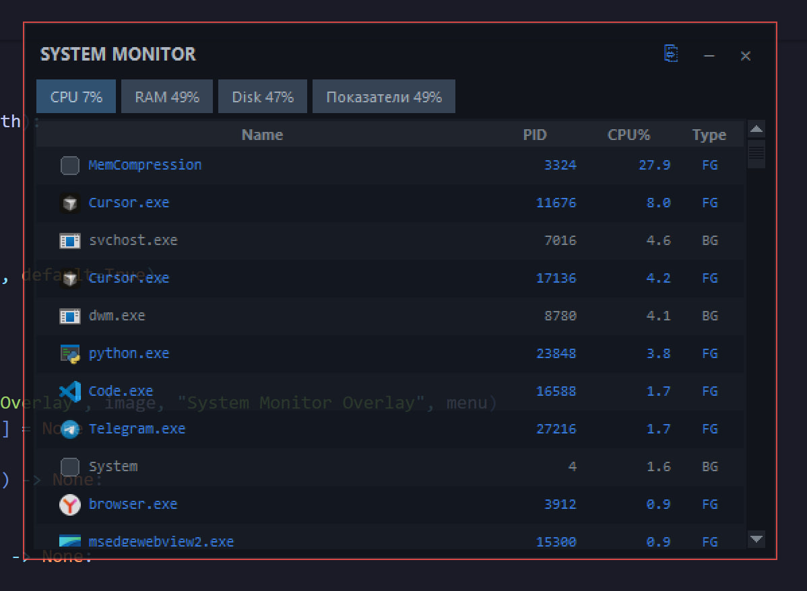
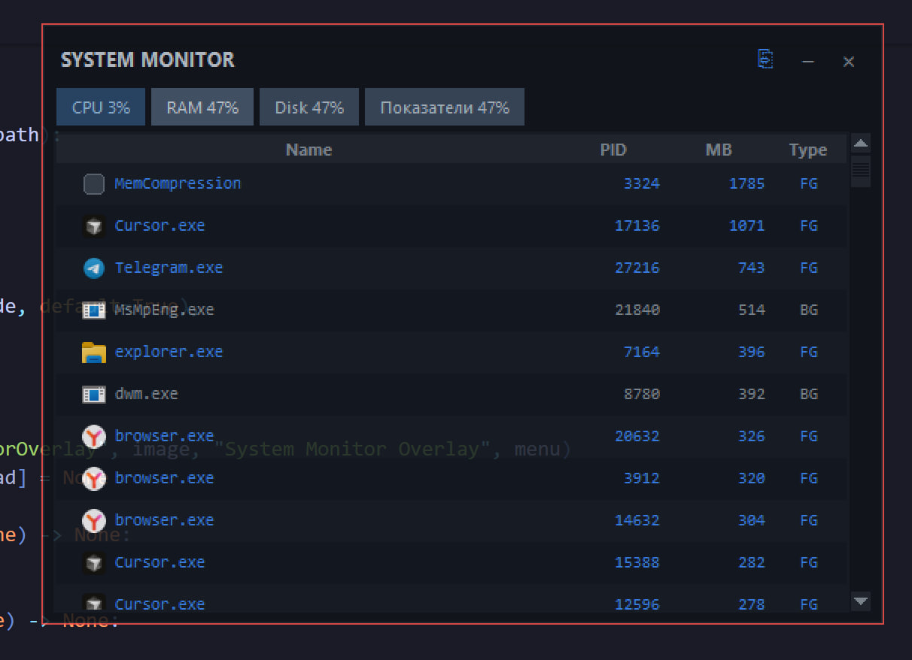
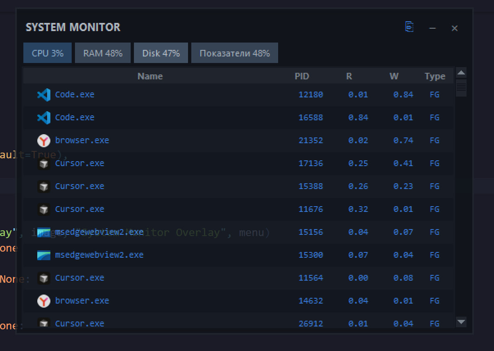
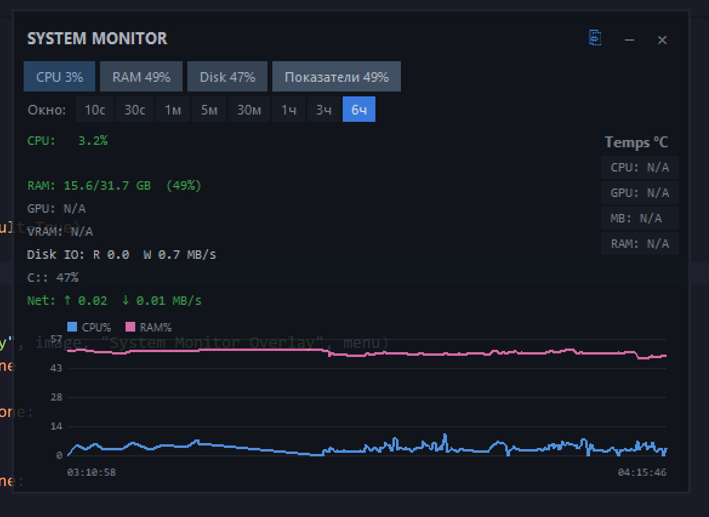
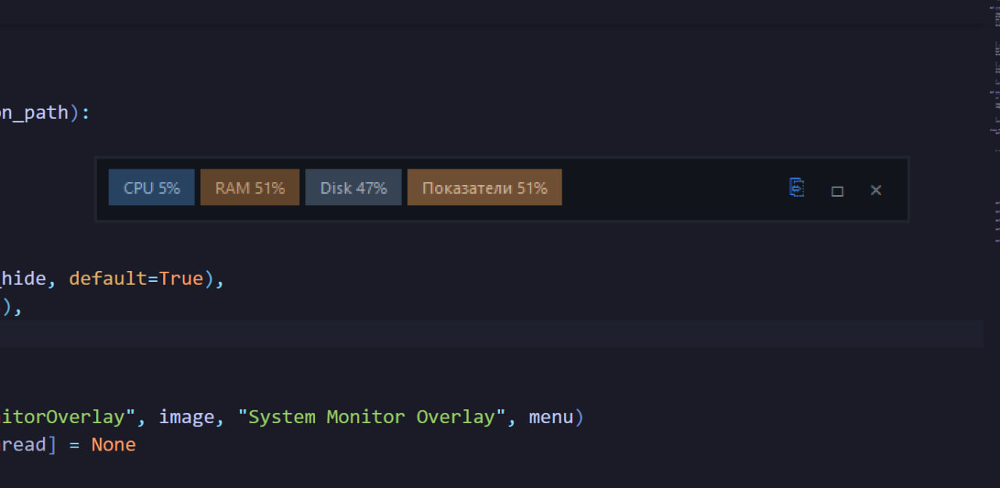
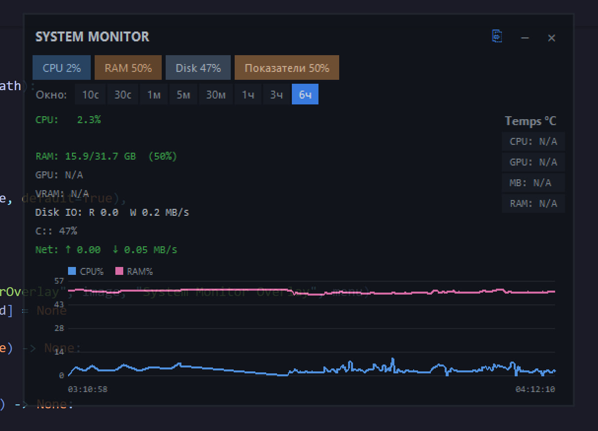

# System Monitor Overlay

[](https://github.com/sellinghub-database/MonitoringSystem/releases/latest)
[](https://www.python.org/)
[](#license)
[](https://github.com/sellinghub-database/MonitoringSystem/releases/latest)

Компактный системный монитор для Windows: CPU, RAM, диск, сеть и температуры в одном оверлее. Сворачивается в одну полоску, живёт в трее, не перекрывает другие окна.

**[Скачать EXE](https://github.com/sellinghub-database/MonitoringSystem/releases/latest)** · **[Все релизы](https://github.com/sellinghub-database/MonitoringSystem/releases)**

---

## Скриншоты

<table>
  <tr>
    <td align="center"><br/><sub>CPU — процессы</sub></td>
    <td align="center"><br/><sub>RAM — память</sub></td>
  </tr>
  <tr>
    <td align="center"><br/><sub>Disk — чтение / запись</sub></td>
    <td align="center"><br/><sub>Показатели и график</sub></td>
  </tr>
  <tr>
    <td colspan="2" align="center"><br/><sub>Свёрнутая полоса: CPU / RAM / Disk / Показатели + копировать / развернуть / закрыть</sub></td>
  </tr>
</table>

<p align="center"><br/><sub>Оверлей поверх редактора — полупрозрачный, без иконки в панели задач</sub></p>

---

## Релизы

| | |
|---|---|
| **Текущий** | [**v1.2.0**](https://github.com/sellinghub-database/MonitoringSystem/releases/tag/v1.2.0) |
| **Файл** | [`SystemMonitorOverlay.exe`](https://github.com/sellinghub-database/MonitoringSystem/releases/latest/download/SystemMonitorOverlay.exe) — один файл, без консоли |
| **В этом релизе** | Рабочая папка `%LOCALAPPDATA%\SystemMonitoring`, логи в `app.log`, без окна консоли |
| **Архив** | [Все версии](https://github.com/sellinghub-database/MonitoringSystem/releases) |

Windows может показать SmartScreen при первом запуске неподписанного EXE — «Подробнее» → «Выполнить в любом случае».

---

## Возможности

- Вкладки **CPU / RAM / Disk / Показатели** с процентами и мягкой цветовой шкалой нагрузки
- Список процессов с иконками, PID, типом FG/BG; мягкое завершение процесса
- Сворачивание в одну строку; клик по вкладке разворачивает нужную панель
- Прилипание к краям экрана, позиция сохраняется через 30 с покоя
- График истории (окно 10 с … 6 ч)
- Трей: Show / Hide, Настройки, Выход. Show на короткое время поднимает окно поверх остальных
- Автозапуск через `HKCU\...\Run`
- Режим click-through (клики проходят сквозь окно)

---

## Данные приложения

После первого запуска файлы создаются здесь:

`%LOCALAPPDATA%\SystemMonitoring\`

| Файл | Назначение |
|------|------------|
| `config.json` | Настройки и позиция окна |
| `stats_history.csv` | История метрик |
| `icon.ico` | Иконка трея |
| `app.log` | Журнал (если логирование включено) |

---

## Запуск из исходников

```powershell
cd MonitoringSystem
py -3 -m venv .venv
.\.venv\Scripts\Activate.ps1
pip install -r requirements.txt
py -3 main.py
```

Требования: Windows 10/11, Python 3.10+.

### Сборка EXE

```powershell
py -3 build.py
```

Результат: `dist\SystemMonitorOverlay.exe`.

### Температуры

CPU / GPU / плата / RAM лучше читаются, если запущен [LibreHardwareMonitor](https://github.com/LibreHardwareMonitor/LibreHardwareMonitor) с WMI. Для NVIDIA GPU есть запасной путь через `nvidia-smi`. Без датчиков в UI будет `N/A`.

---

## English

Compact Windows overlay for CPU, RAM, disk, network, and temperatures. Collapse to a single strip, live in the tray, snap to screen edges. Config and history live under `%LOCALAPPDATA%\SystemMonitoring`.

**[Download EXE](https://github.com/sellinghub-database/MonitoringSystem/releases/latest)** · **[All releases](https://github.com/sellinghub-database/MonitoringSystem/releases)**

- Tabs with load-band colors, process lists, optional process terminate
- Chart history (10s–6h), tray Show/Hide/Settings/Exit
- No console window; file logging to `app.log`
- Build: `py -3 build.py` → `dist\SystemMonitorOverlay.exe`

---

## Спонсоры / проекты

### [SellingHub](https://sellinghub.ru/) — база B2B-контактов и клиентов для бизнеса

Контакты компаний и организаций для поиска клиентов и развития продаж: ЛПР, сегменты по отраслям и регионам, данные для CRM и первого касания.

**[sellinghub.ru](https://sellinghub.ru/)**

---

## License

MIT
